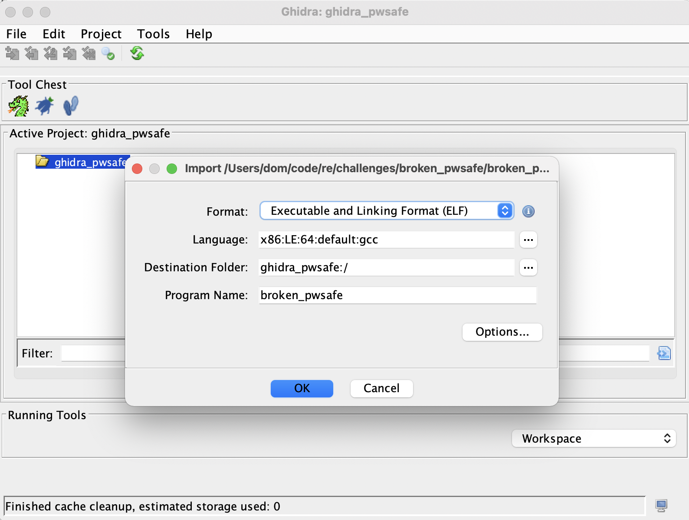
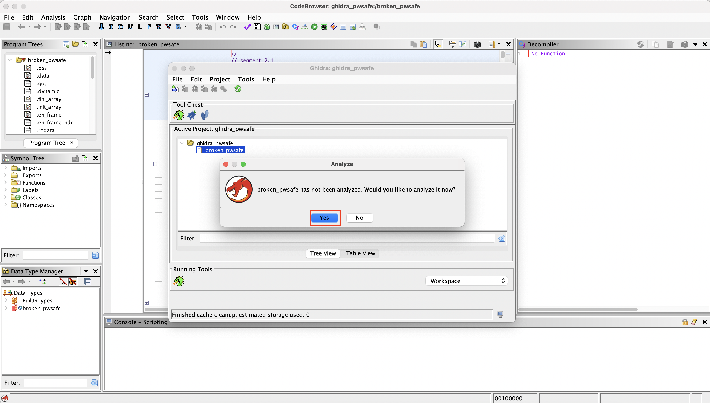
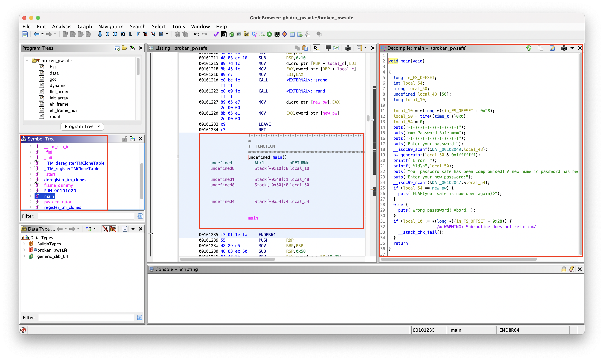

In the past semester, I took a lecture on Reverse Engineering. The goal of Reverse Engineering is to understand as much as possible about a piece of software or system while knowing very little about it. So in most cases, you start with just an executable. Those pieces of compiled software cannot simply be read and understood and in this blog post, I want to talk about the different approaches that can be used to analyze such files. I’ll be using a simple Capture the Flag Challenge I developed for others to try, to walk you through the process.

Let’s start with the tools we need/can use:

* [Ghidra](https://github.com/NationalSecurityAgency/ghidra)
* [Radare2](https://github.com/radareorg/radare2)
* gdb

make sure you have the appropriate Java JDK installed. Additonaly you may need a Hex Editor for some challenges, not for mine though.

Now let's start with our analysis. **Note: If you want to first try it yourself I engourage you to just download the `broken_pwsafe` file and go for it!**

The challange inclduing solution and source files can be found on my GitHub in the [re repo](https://github.com/goseind/re).

Otherwhise follow my lead below. We start with opening the file in gdb which allows us to *savely* run the program and see what it does while having the abbility to stop and look at the current stack anytime. (Please note that for real life situations e. g. maleware analysis it is recommended to use a dedicated VM, which is not conntected to the network in any way!).

xxxx

Radare2 allows us to examin the exectubale in the command line by running the follwing commands:

``` bash
r2 -e bin.cache=true broken_pwsafe
 -- I love the smell of bugs in the morning.
[0x00001120]> s main
[0x00001235]> pd
            ;-- main:
            0x00001235      f30f1efa       endbr64
            0x00001239      55             push rbp
            0x0000123a      4889e5         mov rbp, rsp
            0x0000123d      4883ec50       sub rsp, 0x50
            0x00001241      64488b042528.  mov rax, qword fs:[0x28]
            0x0000124a      488945f8       mov qword [rbp - 8], rax
            0x0000124e      31c0           xor eax, eax
            0x00001250      bf00000000     mov edi, 0
            0x00001255      e896feffff     call sym.imp.time
            0x0000125a      488945b8       mov qword [rbp - 0x48], rax
            0x0000125e      c745b4000000.  mov dword [rbp - 0x4c], 0
            0x00001265      488d3d9c0d00.  lea rdi, str.               ; 0x2008 ; "*********************"
            0x0000126c      e83ffeffff     call sym.imp.puts
            0x00001271      488d3da60d00.  lea rdi, str._Password_Safe_ ; 0x201e ; "*** Password Safe ***"
            0x00001278      e833feffff     call sym.imp.puts
            0x0000127d      488d3d840d00.  lea rdi, str.               ; 0x2008 ; "*********************"
            0x00001284      e827feffff     call sym.imp.puts
            0x00001289      488d3da40d00.  lea rdi, str.Enter_your_password: ; 0x2034 ; "Enter your password:"
            0x00001290      e81bfeffff     call sym.imp.puts
            0x00001295      488d45c0       lea rax, [rbp - 0x40]
            0x00001299      4889c6         mov rsi, rax
            0x0000129c      488d3da60d00.  lea rdi, [0x00002049]       ; "%s"
            0x000012a3      b800000000     mov eax, 0
            0x000012a8      e853feffff     call sym.imp.__isoc99_scanf
            0x000012ad      488b45b8       mov rax, qword [rbp - 0x48]
            0x000012b1      89c7           mov edi, eax
            0x000012b3      e851ffffff     call sym.pw_generator
            0x000012b8      488d3d8d0d00.  lea rdi, str.Error:_        ; 0x204c ; "Error: "
            0x000012bf      b800000000     mov eax, 0
            0x000012c4      e807feffff     call sym.imp.printf
            0x000012c9      488b45b8       mov rax, qword [rbp - 0x48]
            0x000012cd      4889c6         mov rsi, rax
            0x000012d0      488d3d7d0d00.  lea rdi, str._ld_n          ; 0x2054 ; "%ld\n"
            0x000012d7      b800000000     mov eax, 0
            0x000012dc      e8effdffff     call sym.imp.printf
            0x000012e1      488d3d780d00.  lea rdi, str.Your_password_safe_has_been_compromised__A_new_numeric_password_has_been_set. ; 0x2060 ; "Your password safe has been compromised! A new numeric password has been set."
            0x000012e8      e8c3fdffff     call sym.imp.puts
            0x000012ed      488d3dba0d00.  lea rdi, str.Enter_your_new_password: ; 0x20ae ; "Enter your new password:"
            0x000012f4      e8b7fdffff     call sym.imp.puts
            0x000012f9      488d45b4       lea rax, [rbp - 0x4c]
            0x000012fd      4889c6         mov rsi, rax
            0x00001300      488d3dc00d00.  lea rdi, [0x000020c7]       ; "%d"
            0x00001307      b800000000     mov eax, 0
            0x0000130c      e8effdffff     call sym.imp.__isoc99_scanf
            0x00001311      8b55b4         mov edx, dword [rbp - 0x4c]
            0x00001314      8b05fa2c0000   mov eax, dword [obj.new_pw] ; [0x4014:4]=0
            0x0000131a      39c2           cmp edx, eax
        ┌─< 0x0000131c      750e           jne 0x132c
        │   0x0000131e      488d3dab0d00.  lea rdi, str.FLAGyour_safe_is_now_open_again ; 0x20d0 ; "FLAG{your safe is now open again}}"
        │   0x00001325      e886fdffff     call sym.imp.puts
       ┌──< 0x0000132a      eb0c           jmp 0x1338
       │└─> 0x0000132c      488d3dc00d00.  lea rdi, str.Wrong_passsword__Abord. ; 0x20f3 ; "Wrong passsword! Abord."
       │    0x00001333      e878fdffff     call sym.imp.puts
       └──> 0x00001338      90             nop
            0x00001339      488b45f8       mov rax, qword [rbp - 8]
            0x0000133d      644833042528.  xor rax, qword fs:[0x28]
            0x00001346      7405           je 0x134d
            0x00001348      e873fdffff     call sym.imp.__stack_chk_fail
            0x0000134d      c9             leave
            0x0000134e      c3             ret
            0x0000134f      90             nop
            ;-- __libc_csu_init:
            0x00001350      f30f1efa       endbr64
            0x00001354      4157           push r15
            0x00001356      4c8d3d2b2a00.  lea r15, obj.__frame_dummy_init_array_entry ; loc.__init_array_start
                                                                       ; 0x3d88
```

Ghidra often times offers a simpler way and allows you to use a GUI instead of the command line. 

Step 1: Open Ghidra and create a new poroject, then import the `broken_pwsafe` file and double click it.



Step 2: Ghidra asks you if you want to analyse the file, click *Yes* and then *Ok*.



Step 3: Look for the `main` function and click on it. Then you'll already be able to see the source code on the right, in this case (Please note, that in some cases the exceutbale is obfuscted and not that simple to read.)



As you may have noticed, the challenge of this Capture the Flag is not accessing or reading the source code (as we've seen, we can do this quite easily with the above tools), but to figure out what the program does and how we can access whats inside the password safe.

