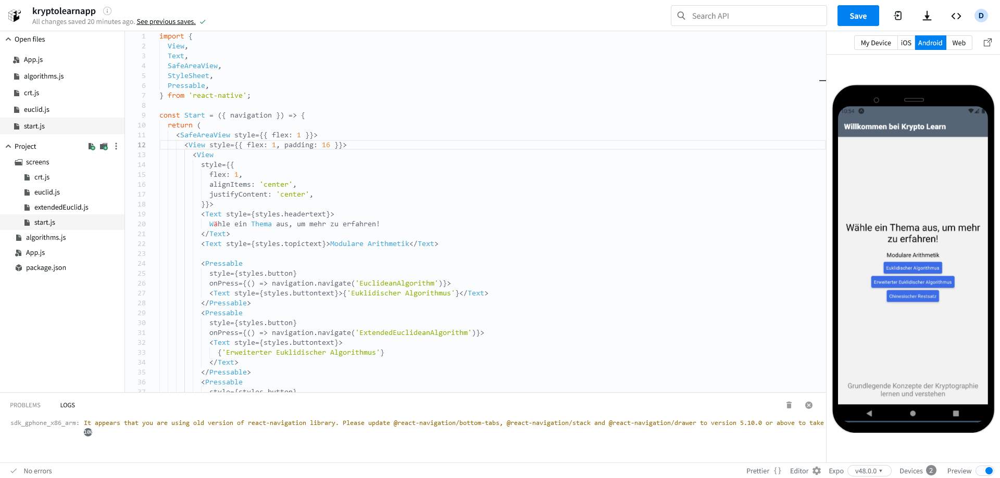
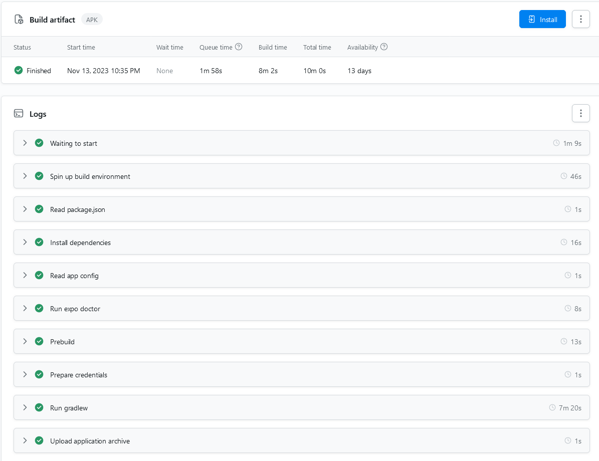

In this post, we'll delve into the structured process of creating React Native apps with Expo.

Expo is a set of tools, libraries, and services built around React Native to simplify the development process. It provides a set of pre-built components and a development environment that eliminates the need for setting up and configuring native build tools. Expo also offers a range of services, such as a cloud build service, which allows you to build and deploy your app without the need for Xcode or Android Studio. Expo is particularly helpful for developers who want to focus on the JavaScript side of their application and reduce the complexity of native development tasks.
<!--more-->
Now, let's dive in and build.

The easiest way to get started is with [Snack](https://snack.expo.dev), a convenient online platform provided by Expo that allows developers to experiment with and share React Native code in a browser-based environment including Android and iOS emulators powered by [Appetize](https://appetize.io/).



This allows you to draft a simple version of your new app without having to worry about installing and configuring things. Once you have a minimal working version of your app you can move to a more sophisticated setup and start working with [EAS CLI tools to build and later submit your app](https://docs.expo.dev/build/introduction/).

With preview APK builds, configured through the `eas.json` file in your project, you can share and download them directly on any device once finished, you'll be provided with a QR code.

```json
{
  "cli": {
    "version": ">= 5.6.0"
  },
  "submit": {
    "production": {
      "android": {
        "track": "internal",
        "releaseStatus": "draft"
      }
    }
  },
  "build": {
    "preview": {
      "distribution": "internal",
      "android": {
        "buildType": "apk"
      }
    }
  }
}
```



With the submitted production profile also listed in the example above you can automatically build ABBs for Google Play Store and submit them there.

This can also be nicely automated with [GitHub Actions](https://docs.expo.dev/eas-update/github-actions/).

More to follow..
