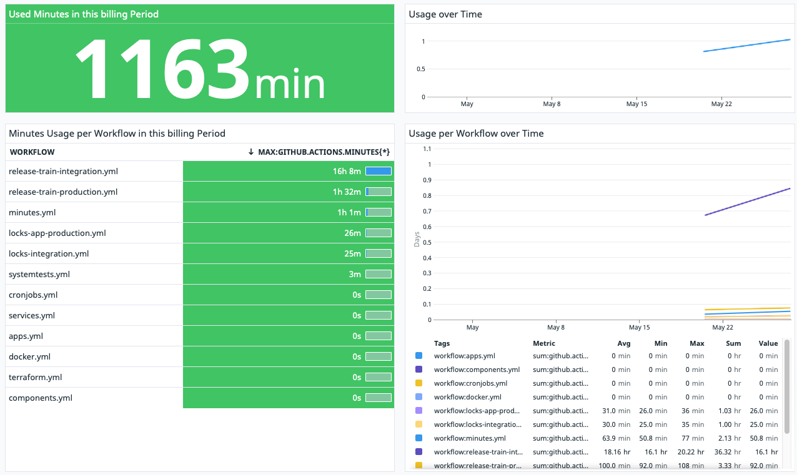

Some time ago, I crafted a [GitHub Actions for a custom Datadog metric](https://github.com/marketplace/actions/workflow-usage-datadog-custom-metric) to meticulously monitor GitHub minutes usage for a substantial project. The primary objective was to gain a precise understanding of how many minutes per workflow were consumed within the billing period, enabling us to pinpoint areas for improvement.
<!--more-->
The workflow triggers a [GitHub API call to fetch the current billing minutes](https://docs.github.com/en/rest/actions/workflows?apiVersion=2022-11-28#get-workflow-usage) for the workflow. Subsequently, this value undergoes conversion and is transmitted to the [Datadog API](https://docs.datadoghq.com/metrics/custom_metrics/). The outcome? You can elegantly display it, perhaps as a time series or table, showcasing the total usage throughout the ongoing billing cycle.

Here's the YAML action configuration:

```yaml
name: Workflow Usage Datadog Custom Metric

author: Domenic Gosein

description: GitHub Action to send minutes usage per workflow to a custom metric in Datadog.

branding:
  icon: 'clock'  
  color: 'orange'

inputs:
  api_key:
    description: 'Datadog API key e.g. from GitHub Actions Secrets'
    required: true
  app_key:
    description: 'Datadog Application Key e.g. from GitHub Actions Secrets.'
    required: true
  repo_path:
    description: 'Repository path e.g. from standard variable.'
    required: true
  wf:
    description: 'Workflow name from strategy matrix.'
    required: true
  tag_workflow_id:
    description: 'Workflow name from strategy matrix.'
    required: true
  github_tk:
    description: 'Github Actions Token from GitHub Actions Secrets.'
    required: true

runs:
  using: 'composite'
  steps:
    - name: Get latest timing trough GitHub API request
      uses: octokit/request-action@v2.1.0
      id: get_latest_timing
      with:
        route: GET /repos/${{ inputs.repo_path }}/actions/workflows/${{ inputs.wf }}/timing
      env:
        GITHUB_TOKEN: ${{ inputs.github_tk }}

    - name: Value check received from API request
      shell: bash
      run: echo ${{ toJSON(fromJSON(steps.get_latest_timing.outputs.data).billable.UBUNTU.total_ms) }}

    - name: Calculate and post latest timing in minutes to Datatdog as a Custom Metric
      shell: bash
      id: post_latest_timing
      run: |
          min=$(($latest_total_ms_ubuntu / 60000))
          echo $min
          export NOW="$(date +%s)"
          curl -X POST "https://api.datadoghq.eu/api/v1/series" \
          -H "Content-Type: text/json" \
          -H "DD-API-KEY: $DD_API_KEY" \
          -d @- << EOF
          {
            "series": [
              {
                "metric": "github.actions.minutes",
                "points": [[${NOW}, $min]],
                "tags": "workflow:$tag_workflow_id",
                "type": "gauge"
              }
            ]
          }
          EOF
      env:
        DD_API_KEY: ${{ inputs.api_key }}
        DD_APP_KEY: ${{ inputs.app_key }}
        latest_total_ms_ubuntu: ${{ toJSON(fromJSON(steps.get_latest_timing.outputs.data).billable.UBUNTU.total_ms) }}
        tag_workflow_id: ${{ inputs.wf }}
```

And here's an exemplary configuration where workflows are defined in a matrix:

```yaml
on:
  workflow_run:
    workflows: [Worfklow One, Workflow Two] # Runs when one of the workflow defined in the brackets is run and completed
    types:
      - completed
  schedule:
    - cron: 30 23 * * 1,3,5 # At 23:30 on Monday, Wednesday, and Friday
  workflow_dispatch:

jobs:
  updateWorkflowTimings:
    runs-on: ubuntu-latest
    strategy:
      matrix:
        WFs: [workflow_one.yml, workflow_two.yml] # Runs for each workflow defined in the brackets
    steps:
      - name: Use my action
        uses: goseind/datadog-gh-actions@v1.0.0
        with:
          api_key: ${{ secrets.DATADOG_API_KEY }}
          app_key: ${{ secrets.DATADOG_APPLICATION_KEY }}
          repo_path: ${{ github.repository }}
          tag_workflow_id: ${{ matrix.WFs }}
          wf: ${{ matrix.WFs }}
          github_tk: ${{ secrets.GITHUB_TOKEN }}
```

This is how it would manifest in a Datadog Notebook with a neat visualization of the GitHub actions minutes:


