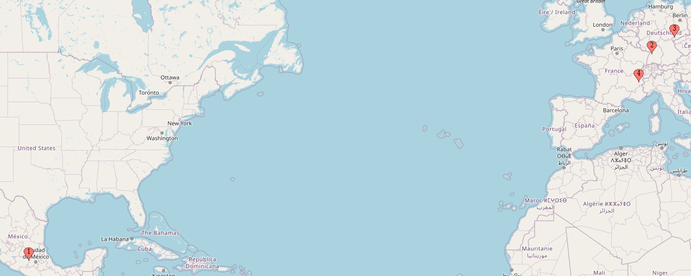

With over 11 years in the IT industry and experience in various roles across industries and locations, I bring a diverse technical background to the table. My expertise ranges from systems administration tasks, such as managing bare-metal servers and networks, to navigating the realm of cloud-native infrastructure. While I excel in DevOps and SRE, my innate curiosity drives me to constantly explore new concepts and technologies. I thrive in dynamic, international teams and consider myself a very structured and open-minded person.

I am currently working as a Platform Engineer for [jambit](https://jambit.com/) in the city of Munich.

*The photo above captures me during JupyterCon 2023 in Paris, where I showcased the accomplishments of my team at CERN. Learn more about it in [this post]().*

**Table of contents:**
- [Some history about me](#some-history-about-me)
- [Things I know and have worked with](#things-i-know-and-have-worked-with)
- [How to reach me (and get my CV)](#how-to-reach-me-and-get-my-cv)
- [In my free time](#in-my-free-time)
- [Where we may have met](#where-we-may-have-met)

## Some history about me

Before taking up my role as Platform Engineer in Munich, my curiosity about all things fundamental to understanding our universe and human progress led me to work as a Software/DevOps engineer at [CERN](https://home.cern/), where I was able to contribute to some of the incredible software CERN builds to store and analyze data.

As a Software/DevOps engineer, I was responsible for the deployment of a European open science federated data infrastructure that allowed scientists from all over Europe to share and analyze data from experiments. My team published a [paper on the platform](https://arxiv.org/abs/2305.10166). Along the way, I was able to contribute to other open source projects at CERN, such as [Rucio](http://rucio.cern.ch/) and [REANA](https://reana.io/).

I also gave a talk about the project at CERN at JupyterCon 2023 in Paris, here the [YouTube Recording](https://youtu.be/JGQpdivaNtI?t=1030).

Previously, I worked for [EDEKA Digital](https://digital.edeka/), where I was part of the newly formed SRE team responsible for the infrastructure of a new inventory management system called [NEMO](https://digital.edeka/projekte/nemo/), which now runs as an app on Android devices in almost every EDEKA store in Germany.

Before that, I worked as a consultant for [EY's Technology Risk division](https://www.ey.com), where I also completed my bachelor's degree in cooperation with the [Baden-Württemberg Cooperative State University (DHBW)](https://www.mannheim.dhbw.de/en). I wrote my bachelor thesis about automated IT audits for SAP systems.

And before that, I worked for [KERN-LIEBERS](https://www.kern-liebers.com) in both Germany and Mexico. I was responsible for the administration of various hardware and software, ranging from servers to network devices and firewalls.

At KERN-LIEBERS I completed my apprenticeship as an IT Administrator with a focus on systems integration.

I obtained my Master's degree in Computer Science with a specialisation in Software Engineering from [University of Applied Sciences Mannheim](https://www.english.hs-mannheim.de/the-university.html). I wrote [my thesis at CERN](http://cds.cern.ch/record/2872615?ln=en) on the IT architecture requirements for a future physics data processing and analysis system.

## Things I know and have worked with

During my time as a software engineer, I've worked with numerous technologies and tools. As for programming, I'm most experienced in Python. I have worked a lot with Kubernetes and surrounding technologies from the cloud-native stack.

Besides that, I have worked with and have experience in embedded and robotic systems, working with microcontrollers like Arduiono and ROS, you can find one of the projects about an autonomous robot for detecting and collecting objects [here](https://nbn-resolving.org/urn:nbn:de:bsz:953-opus-1006).

I also did some web/mobile software engineering and published an app for learning cryptography, called [Krypto Learn](https://play.google.com/store/apps/details?id=com.dom325345.kryptolearn), which is written in React JS with the Expo Framework.

But the list and my interests do not end there, I always like to try new things and expand my knowledge. So here is an *incomplete list* of things I have worked with, sorted by topic and experience:

| Tech stack | Much experience | Less experience |
| -------- | ------- | ------- |
| Languages | Python, Bash, JavaScript (React) | SQL, Ruby, C, Rust, C++ |
| Infrastructure & Backend | Linux, OpenStack, Kubernetes, Docker, Helm, Terraform, Flux, ArgoCD, YAML, GitHub Actions, GitLab CI, Google Cloud, Microsoft Azure, Grafana, ELK (Kibana), Datadog, PostgreSQL, IAM/OIDC/OAuth (Keycloak), JupyterHub, VMWare, HP Server, Cisco, PaloAlto, Windows server | AWS, Hadoop, Spark, Dask, Flask, Cassandra, ROS |
| General  | Git, Networking |  |
| Orga methods and tools | DevOps, SRE, Infrastructure as Code, CI/CD, Kanban, Scrum, Slack, Teams, GitHub Projects, SAP, .. |  |

I speak four languages, some of them better than others, like German (my mother tongue) and English, but also Spanish quite well and a bit of French.

## How to reach me (and get my CV)

The best way to contact me is through [LinkedIn](https://www.linkedin.com/in/goseind/), and I'm sorry if it sometimes takes a while for me to respond. This way you can also ask for my CV.

## In my free time

In my free time I enjoy rock climbing, mountain biking and mountaineering. When it snows, I switch from my hiking boots to my skis.

I also play the guitar, my favorite artist and inspiration is [Carlos Santana](https://open.spotify.com/intl-de/track/0GF3otbUk5UX64xnPzGyve?si=582bc403019f4362). I also listen a lot to Led Zeppelin, David Bowie and Bob Dylan.

## Where we may have met

I have been incredibly lucky to not only travel the world, but to live in **(1) Queretaro**, Mexico, (2) **Mannheim** and (3) **Leipzig**, Germany, and (4) **Geneva**, Switzerland:

*The favicon for this page was created with materials from [Kiranshastry on Flaticon](https://www.flaticon.com/free-icons/data) and the map with [mapcustomizer](https://www.mapcustomizer.com/).*
