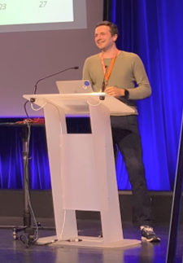

My curiosity about all things fundamental to understanding our universe and human progress led me to work as a software and DevOps engineer at [CERN](https://home.cern/), where I was able to contribute to some of the incredible software CERN builds to store and analyze data. I enjoy understanding and learning about the entire tech stack and thrive in international teams.

## Some History

I worked as a software and DevOps engineer for [CERN](https://home.cern/), where I was responsible for the deployment of a European open science federated data infrastructure that allowed scientists from all over Europe to share and analyze data from experiments. My team published a [paper on the platform](https://arxiv.org/abs/2305.10166). Along the way, I was able to contribute to other open source projects at CERN, such as [Rucio](http://rucio.cern.ch/) and [REANA](https://reana.io/).

Previously, I worked for [EDEKA Digital](https://digital.edeka/), where I was part of the newly formed SRE team responsible for the infrastructure of a new inventory management system called [NEMO](https://digital.edeka/projekte/nemo/), which now runs as an app on Android devices in almost every EDEKA store in Germany.

Before that, I worked as a consultant for [EY's Technology Risk division](https://www.ey.com), where I also completed my bachelor's degree in cooperation with the DHBW Mannheim. I wrote my bachelor thesis about query enhancements for automated IT audits for SAP systems.

And before that, I worked for [KERN-LIEBERS](https://www.kern-liebers.com) in both Germany and Mexico. I was responsible for the administration of various hardware and software, ranging from servers to network devices and firewalls.

At KERN-LIEBERS I completed my apprenticeship as an IT Administrator with a focus on systems integration.

I'm currently finishing my Master's degree in Computer Science with a focus on Software Engineering at [University of Applied Sciences Mannheim](https://www.english.hs-mannheim.de/the-university.html). I wrote [my thesis at CERN](http://cds.cern.ch/record/2872615?ln=en) on the IT architecture requirements for a future physics data processing and analysis system.

## Things I know and worked with

During my time as a software engineer, I've worked with numerous technologies and tools. As for programming, I'm most experienced in Python. I have worked a lot with Kubernetes and surrounding technologies.

Besides that, I have worked with and have experience in embedded and robotic systems, working with microcontrollers like Arduiono and ROS, you can find one of the projects about an autonomous robot for detecting and collecting objects [here](https://nbn-resolving.org/urn:nbn:de:bsz:953-opus-1006).

I also did some mobile software engineering and published an app for learning cryptography, called [Krypto Learn]().

But the list and my interests do not end there, I always enjoy trying new things and expanding my knowledge. So here is a incomplete list of things I have worked with:

## Contact

The best way to contact me is through LinkedIn, and I'm sorry if it sometimes takes a while for me to respond.

## In my free time

tbd

The favicon for this page was created with materials from [Kiranshastry on Flaticon](https://www.flaticon.com/free-icons/data).
